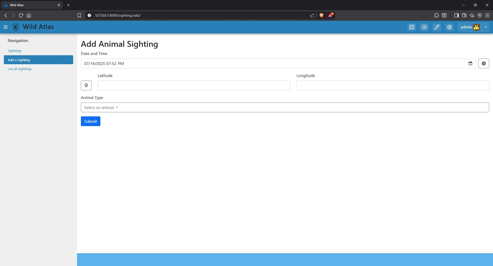

# WildAtlas
- [WildAtlas](#wildatlas)
- [Purpose](#purpose)
  - [Features](#features)
  - [Views](#views)
  - [Roadmap](#roadmap)
- [Getting Started](#getting-started)
  - [Prerequisites](#prerequisites)
  - [Installation](#installation)
  - [Usage](#usage)
  - [Testing](#testing)

# Purpose

- Wild Atlas is an interactive wildlife tracker Tethys application. It allows users to log, view, and manage animal sightings on a map, with support for custom animal icons and geospatial data.
- This was developed, in part, for the Tethys Summit 2025.

## Features
- Add new animal sightings with date, time, location, and animal type.
- View all past sightings in a sorted table.
- Interactive map displaying animal sightings with custom icons.
- Dynamic starting map fitted to include all entered sightings.
- Manage animal types and their associated icons.
- Persistent storage using a PostGIS-enabled PostgreSQL database.
- REST API endpoint for deleting sightings (with token authentication).
- Responsive UI with Bootstrap and custom JavaScript for enhanced interactivity.

## Views




## Roadmap
- [X] Convert Animal lookup and storage information into ID's 
- [X] Increase Input validation.
- [ ] User should not be able to turn off the map.
- [ ] Add AnimalId form validation
- [ ] Automated Testing
- [ ] Streamline the install and setup documentation.
- [ ] Allow random sighting generation to be configurable.
- [ ] Allow for image upload

# Getting Started
## Prerequisites
- Tethys Platform (>=4.0.0)
- Docker (for running PostGIS, or a local PostgreSQL/PostGIS instance)
- Python 3.12+

## Installation
1. Clone the repository
2. Set up / run the database (postgis docker container)
3. Update your Tethys portal database settings if needed.
4. Activate your tethys environment
5. Install tethys application

``` cmd
cd tethysapp-wildatlas
tethys install -d 
```

6. Preform database migrations
   - After the application is installed run the following command to initialize the database.
     - `tethys manage syncstores wildatlas`
   - Initializing the database loads the registered animals and stores them as valid selection options as well as loads the respective assets. 
   - The first time this is run the database will also generate a random sighting per registered animal within the yellowstone national park area to verify all assets render as expected.
   - Generation can be repeated with the following command `tethys manage syncstores wildatlas --firsttime`.

7. Run the Tethys development server
- `Tethys Manage Start`
- Access the app at `http://127.0.0.1:8000/`


## Usage
- Map View: The home page displays an interactive map with all animal sightings.
- Add Sighting: Use the "Add a Sighting" navigation link to log a new animal sighting.
> :warning: The browser **AND** the operating system location and permission settings need to be configured to allow for the location button to function properly. Easiest with Chrome. Brave gets a little touchy about providing location data. 
- View Sightings: Use the "Sightings" or "List all Sightings" links to view and manage all logged sightings.

## Testing
- TODO

<p align="center">
  
</p>
